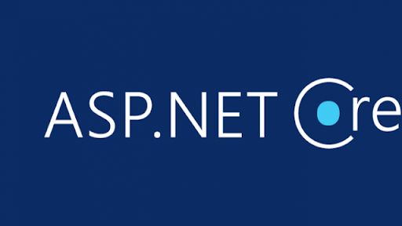

# Hello! 👋 I'm Jozef!

[Portfolio](https://jozefpodlecki.github.io/)

[Blog](https://jozefpodlecki.github.io/Blog/)

## My techstack

  
  
  
  
  
  
  
  

  
## I'm currently working on

* [hr web app](https://github.com/Jozefpodlecki/HRApp)
* [web app for learning languages](https://github.com/Jozefpodlecki/language-learning-platform)
* [web app for searching geographic features](https://github.com/Jozefpodlecki/geo-shapes)

## How to reach me

[LinkedIn](https://www.linkedin.com/in/jozef-witold-podlecki/)
